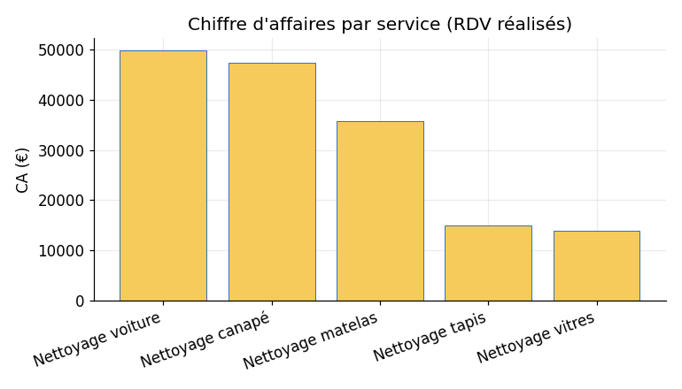
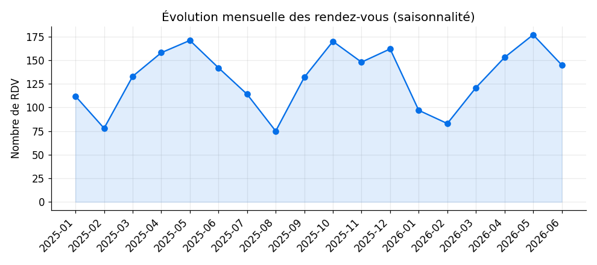
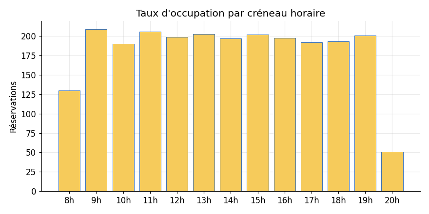

# Clean Pro Agency — Module Analytics

Analyse des données de rendez-vous de Clean Pro Agency, **de la donnée brute à la
décision** : génération d'un jeu de données réaliste, requêtes SQL, exploration
Python et tableau de bord interactif.

> Jeu de données de **démonstration** (généré) : **500 clients · 2 371 rendez-vous
> · 983 avis**, sur la période **janv. 2025 → juin 2026**.

---

## Indicateurs clés (KPIs)

| Indicateur | Valeur |
|---|---|
| Rendez-vous | **2 371** (dont 2 139 réalisés) |
| Chiffre d'affaires estimé | **≈ 161 800 €** |
| Panier moyen | **75,7 €** |
| Note moyenne | **4,18 / 5** |
| Taux d'annulation | **9,8 %** |
| Clients actifs | **490 / 500** |

---

## Principaux enseignements

**1. Deux prestations portent le business.** Le *nettoyage voiture* et le
*nettoyage canapé* dominent à la fois en volume et en chiffre d'affaires.



**2. Forte saisonnalité.** Creux marqué en **août**, pics au **printemps** et en
**fin d'année**. À exploiter pour planifier les équipes et animer les périodes creuses.



**3. Concentration temporelle.** Le **samedi** et certains créneaux concentrent la
demande → tension sur les ressources à ces moments.



**4. Fidélisation sous-exploitée.** ~**68 %** des rendez-vous sont *ponctuels* :
convertir une partie vers des offres *mensuelles / trimestrielles* est un levier
direct de revenus récurrents.

**5. Clientèle très locale.** Forte concentration sur **Ramonville-Saint-Agne** et
**Toulouse**.

### Recommandations
- **Offres en période creuse** (août, mardi/mercredi, créneaux vides).
- **Abonnement** pour convertir les clients ponctuels.
- **Renfort le samedi** et sur les créneaux saturés.
- **Marketing local** ciblé Ramonville / Toulouse, puis communes limitrophes.
- Suivi continu via le **tableau de bord**.

---

## Contenu du module

```
analytics/
├── data/
│   ├── clients.csv, services.csv, rendez_vous.csv, avis.csv   # dataset généré
│   └── seed_cleanpro.sql        # injection dans MariaDB (schéma réel)
├── sql/
│   └── analyses.sql             # 12 requêtes analytiques (KPIs)
├── notebook/
│   └── analyse_cleanpro.ipynb   # exploration Python (pandas + matplotlib)
├── dashboard/
│   ├── dashboard.html           # tableau de bord interactif (Chart.js)
│   └── aggregates.json          # données agrégées
└── img/                         # graphiques exportés
```

## Comment l'utiliser

**Tableau de bord** : ouvrir `dashboard/dashboard.html` dans un navigateur (autonome).

**Notebook** : ouvrir `notebook/analyse_cleanpro.ipynb` (les graphiques sont déjà
intégrés ; ré-exécutable avec `pandas` + `matplotlib`).

**SQL sur données réelles** : dans phpMyAdmin, importer `data/seed_cleanpro.sql`
(charge le dataset dans la base `cleanpro`), puis exécuter les requêtes de
`sql/analyses.sql`.

**Régénérer le dataset** : les scripts Python de génération/analyse produisent les
CSV, les graphiques et `aggregates.json`.

---

## Démarche (chaîne data analyst)

1. **Collecte / génération** — dataset réaliste (saisonnalité, géographie, mix services).
2. **Nettoyage & préparation** — typage, variables dérivées (mois, heure, jour), filtrage des RDV réalisés.
3. **Analyse exploratoire (EDA)** — volume, CA, saisonnalité, occupation, fidélité, satisfaction.
4. **Visualisation** — graphiques + tableau de bord.
5. **Restitution** — insights et recommandations actionnables.

> Note : les colonnes `telephone` et `code_postale` gagneraient à être stockées en
> `VARCHAR` (les types entiers suppriment les zéros initiaux). Rattacher `rdv` au
> catalogue `service` via `id_service` fiabiliserait le calcul du chiffre d'affaires.
